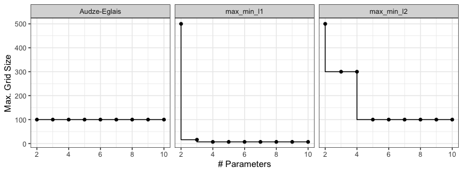

# sfd - Space-Filling Designs

<!-- badges: start -->

[](https://CRAN.R-project.org/package=sfd)
[](https://github.com/topepo/sfd/actions/workflows/R-CMD-check.yaml)
[](https://app.codecov.io/gh/topepo/sfd?branch=main)
<!-- badges: end -->

The goal of sfd is to make available a number of pre-optimized
space-filling designs (SFDs) originating from
[`https://www.spacefillingdesigns.nl/`](https://www.spacefillingdesigns.nl/)
and the `mixtox` package. For the former, the original website offers no
guarantee or license but does state that

> All these designs have been compared and the best designs are
> collected on this website. They can be downloaded for free and used in
> your specific simulation environment.

The available designs in this package are for experiments where the
number of parameters ranges from two to 15 of types `"audze_eglais"`,
`"max_min_l1"`, `"max_min_l2"`, `"max_min_l1`“, and `"uniform"`.

The package has a function to see if a design is available
(`sfd_available()`) and to retrieve it (`get_design()`).

The number of designs varies across type:



## Installation

The package can be installed from CRAN using

``` r
install.packages("sfd")
```

You can install the development version of sfd like so:

``` r
pak::pak("topepo/sfd")
```

## Code of Conduct

Please note that the sfd project is released with a [Contributor Code of
Conduct](https://contributor-covenant.org/version/2/1/CODE_OF_CONDUCT.html).
By contributing to this project, you agree to abide by its terms.
